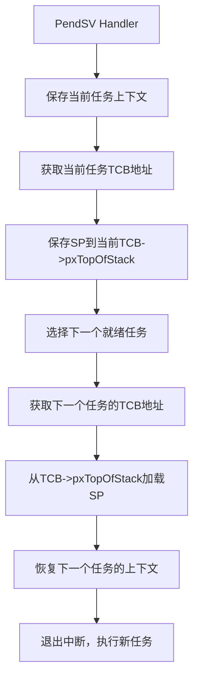

<!-- ## 
<details>
    <summary>展开</summary>

</details> -->

# RTOS

## 1、嵌入式操作系统（如RTOS）和通用操作系统（如Linux）的区别

<details>
    <summary>展开</summary>

### 核心摘要

*   **通用操作系统 (GPOS - General-Purpose Operating System)**：如 Linux、Windows、macOS。其设计目标是**通用性**，力求在功能丰富的硬件上为用户提供广泛的、多样化的服务（如办公、娱乐、网络浏览）。它强调**公平地**为所有应用分配资源，追求**平均吞吐量最大化**。
*   **嵌入式实时操作系统 (RTOS - Real-Time Operating System)**：如 FreeRTOS、VxWorks、Zephyr。其设计目标是**专用性**，通常为特定的嵌入式设备而设计。它最核心的特性是**可预测性**和**确定性**，即保证任务在**严格的时间限制**内完成，有时甚至需要牺牲吞吐量和功能来换取可靠性。

---

### 详细对比表

| 特性维度              | 嵌入式操作系统 (RTOS)                                                                                                                                                                                                                      | 通用操作系统 (如 Linux)                                                                                                                                                                            |
| :-------------------- | :----------------------------------------------------------------------------------------------------------------------------------------------------------------------------------------------------------------------------------------- | :------------------------------------------------------------------------------------------------------------------------------------------------------------------------------------------------- |
| **1. 设计目标与哲学** | **确定性**和**可靠性**。保证系统对事件响应的时间是可预测的，满足硬实时或软实时要求。                                                                                                                                                       | **通用性**和**吞吐量**。公平地为所有应用程序和服务分配资源，追求整体系统性能和用户体验。                                                                                                           |
| **2. 实时性**         | **核心特性**。<br>**硬实时 (Hard Real-Time)**：严格保证在最坏情况下也能在截止时间前完成响应，超时即意味着系统失败（如汽车安全气囊、飞控系统）。<br>**软实时 (Soft Real-Time)**：尽可能在截止时间前完成，偶尔超时可以接受（如流媒体播放）。 | **非实时或弱实时**。默认内核不支持硬实时，因为其调度器、中断处理、内存管理等因素会引入不可预测的延迟。<br>可以通过打**实时补丁**（如 Linux 的 PREEMPT_RT）来增强实时性，但通常难以达到硬实时要求。 |
| **3. 系统资源与尺寸** | **极其精简**（微内核架构常见）。内核非常小（通常几KB到几十KB），仅提供最核心的任务调度、通信、同步机制，其他功能按需添加。                                                                                                                 | **非常庞大**（宏内核架构常见）。内核包含了进程管理、文件系统、网络协议栈、设备驱动等大量功能，尺寸从几MB到几百MB甚至更大。                                                                         |
| **4. 硬件要求**       | **极低**。可以在资源极其有限的MCU（微控制器）上运行，如只有几十KB RAM和几百KB Flash的ARM Cortex-M、ESP32、AVR等芯片。                                                                                                                      | **较高**。需要MMU（内存管理单元）、足够的RAM（通常百MB级以上）和存储空间来运行其复杂的子系统。                                                                                                     |
| **5. 调度策略**       | **基于优先级的抢占式调度**是标准。高优先级的任务总是可以立即抢占低优先级任务，以确保关键任务得到及时响应。调度器行为简单、 deterministic。                                                                                                 | **更复杂**的调度算法（如CFS - 完全公平调度器）。旨在让所有进程“公平”地使用CPU，提高整体交互体验。调度决策更复杂，耗时可能不确定。                                                                  |
| **6. 内核行为**       | **可抢占**。即使在执行系统调用（内核态）时，更高优先级的任务也能将其抢占，从而极大减少响应延迟。                                                                                                                                           | **默认不可完全抢占**。进程在**内核态**执行系统调用时，通常不能被其他用户态进程抢占，这会导致较大的、不可预测的延迟（这就是需要实时补丁的原因）。                                                   |
| **7. 内存管理**       | **通常无MMU**，采用平坦内存模型。所有任务共享同一内存空间，编程时需要开发者自己注意内存安全问题。**静态分配**内存非常常见。                                                                                                                | **依赖MMU**，提供**虚拟内存**机制。每个进程都有独立的、受保护的虚拟地址空间，安全性高。支持动态内存分配和交换（Swap）。                                                                            |
| **8. 开发与调试**     | **更接近硬件**的开发。通常使用交叉编译，在主机上编译代码，然后烧录到目标设备。调试可能依赖JTAG/SWD仿真器或日志输出。                                                                                                                       | **开发环境友好**。拥有强大的本地开发工具链、丰富的库和框架。调试和分析工具（如GDB、Valgrind）非常成熟。                                                                                            |
| **9. 用户界面与功能** | **通常无UI或只有极其简单的UI**。功能单一，只为完成特定任务。                                                                                                                                                                               | **拥有丰富的图形用户界面（GUI）**。支持大量应用程序和多任务操作。                                                                                                                                  |
| **10. 许可与成本**    | **多样化**。有许多优秀的开源选择（如 **FreeRTOS**（MIT许可）、**Zephyr**（Apache 2.0）、**RIOT**）。也有商业闭源版本（如 **VxWorks**、**ThreadX**），提供专业支持和认证。                                                                  | **主要以开源为主**。如 Linux（GPL）是免费的，但商业发行版（如Red Hat）可能需要付费获取支持。Windows是闭源商业软件。                                                                                |

---

### 一个重要趋势：界限的模糊

随着芯片性能的提升和成本的下降，两者之间的界限正在变得模糊：
1.  **Linux 的嵌入式化**： 像 **Yocto Project** 这样的工具允许开发者为特定硬件定制一个极其精简的Linux系统，用于资源相对较多的嵌入式场景（如智能网关）。
2.  **RTOS 的功能丰富化**： 像 **Zephyr** 这样的现代RTOS，提供了功能丰富的网络协议栈、文件系统、甚至Python支持，同时保持了其实时核心。

    </details>


## 2、为什么即使使用了软实时补丁，通用操作系统依然难以达到硬实时要求？

<details>
    <summary>展开</summary>

硬实时要求的关键是**确定性（Determinism）**，即在**最坏情况（Worst-Case）** 下，系统的响应时间也必须是可知且可靠的。通用操作系统的设计哲学和底层架构中存在许多固有的、难以完全消除的**非确定性（Non-Determinism）** 来源。

即使实时补丁解决了大部分软件层面的问题，以下这些根本性的挑战依然存在：

---

### 1. 硬件中断延迟（Hardware Interrupt Latency）

这是最根本的物理限制。实时补丁无法改变硬件特性。

*   **CPU 流水线与缓存**：现代高性能 CPU 使用复杂的流水线、多级缓存（L1, L2, L3）、预测执行等技术来提升**平均性能**。但当一个高优先级中断到来时，CPU 可能正在执行一条复杂的指令，或者需要从慢速的主内存中获取数据（**缓存未命中，Cache Miss**）。**最坏情况下的缓存未命中会带来巨大且不可预测的延迟**（可能达到数百个时钟周期）。RTOS 通常运行在简单的微控制器（MCU）上，没有缓存或缓存很小，其行为更可预测。
*   **外设与总线延迟**：中断可能需要经过多个总线桥和中断控制器（如 APIC）才能到达 CPU 核心，这些路径上的延迟也存在变化。
*   **电源管理**：为了节能，CPU 核心或整个芯片可能处于低功耗睡眠状态。从中断唤醒到全速运行（`C-state` 到 `P-state` 的转换）会引入显著且可变的延迟。

实时补丁无法保证硬件在最坏情况下的行为，它只能优化软件对中断的响应。

### 2. 内存管理单元（MMU）与虚拟内存

通用操作系统（如 Linux）严重依赖 MMU 来实现虚拟内存、进程隔离和内存保护。这是其强大功能和安全性的基石，但也是实时性的天敌。

*   **转换后备缓冲区未命中（TLB Miss）**：CPU 访问内存需要通过 MMU 将虚拟地址转换为物理地址。最常用的映射关系会存储在一個极小的片上缓存——TLB 中。如果需要的映射不在 TLB 中（即 TLB Miss），CPU 必须暂停当前任务，去执行一个“页表遍历”操作来查找正确的映射。**这个过程的耗时是不确定的**，取决于页表的复杂度和内存访问速度。
*   **页错误（Page Fault）**：如果一个进程访问的内存页尚未被加载到物理内存中（例如被换出到磁盘，或尚未分配），就会触发一个页错误中断。操作系统需要从磁盘（**巨大的、毫秒级的延迟**）或重新分配一页内存来处理这个错误。这在硬实时系统中是绝对不允许的。

实时补丁无法绕过 MMU，因此 TLB Miss 和 Page Fault 的延迟风险始终存在。真正的硬实时系统通常**禁用 MMU**，或者使用**静态内存锁定**来避免这些情况，但这牺牲了通用性和安全性。

### 3. 内核的不可抢占部分（Non-Preemptible Sections）

实时补丁（如 `PREEMPT_RT`）的核心工作就是将内核**最大限度地可抢占化**。它通过将自旋锁（spinlock）转换为可睡眠的互斥锁（mutex）、将中断处理程序线程化等方式，极大地减少了内核中不可被抢占的代码区域。

然而，**理论上仍然存在极短的、必须关闭中断的临界区**。例如：
*   在修改核心调度队列本身时。
*   在底层中断控制器进行操作时。
*   某些架构特定的极其底层的操作。

这些区域虽然被压缩到极致（可能只有几十条指令），但对于某些要求极其苛刻的硬实时应用（微秒级响应），**这几十条指令的执行时间在最坏情况下也可能是不可接受的**。而一个设计优良的 RTOS，其关中断的临界区通常更短且行为完全可知。

### 4. 系统整体复杂性与“噪声”

通用Linux系统是一个巨大的、动态的复杂系统，充满了“噪声”，这些噪声会干扰实时任务。

*   **其他中断**：系统可能挂载了多个设备（网卡、硬盘、GPU），它们都会产生中断。虽然实时补丁试图将中断线程化以降低影响，但大量中断的涌入仍然会占用 CPU 时间，增加调度延迟。
*   **多核同步（SMP）**：在多核系统上，一个核心上的任务可能会因为等待另一个核心上的锁而被阻塞（**远程核心争用**）。这种延迟非常难以预测。
*   **电源管理与热调控（Thermal Throttling）**：当 CPU 温度过高时，硬件会自动降频以防止损坏。**CPU 频率的突然变化会直接导致任务执行时间的不确定**。
*   **BIOS/UEFI 和微码（Microcode）**：底层的硬件固件可能包含电源管理或错误修复例程（例如针对 Spectre/Meltdown 漏洞的补丁），这些微码更新会在特定情况下被触发，引入不可预测的延迟。

### 结论：软实时 vs. 硬实时

打了实时补丁的 Linux（`PREEMPT_RT`）的性能已经**非常出色**，它能够将调度延迟从毫秒级降低到**几十微秒**级别。这使得它非常适合**软实时（Soft Real-Time）** 和**大多数苛刻的实时应用**，例如：
*   工业机器人
*   专业音频处理
*   高速数据采集

但是，对于**真正的硬实时系统**，例如：
*   汽车防抱死系统（ABS）：必须在几毫秒内做出响应，否则会导致事故。
*   飞机电传飞控系统（Fly-by-Wire）：响应延迟必须绝对有上限。
*   心脏起搏器：一次错过截止期就意味着生命危险。

在这些领域，**最坏情况下的响应时间必须是已知且绝对可靠的**。通用操作系统由于其复杂的硬件和软件架构，无法提供这种级别的保证和确定性。因此，它们仍然需要选择那些从设计之初就为确定性而生的、精简的、通常不带MMU的**实时操作系统（RTOS）**。

</details>

## 3、RTOS中的任务

<details>
    <summary>展开</summary>

FreeRTOS 中的任务是系统调度和执行的独立单元。理解任务的管理机制对构建稳定可靠的嵌入式系统至关重要。下面我将以 FreeRTOS 为例，为你详细介绍任务的构成、创建、状态管理以及调度切换等内容。

### 一、任务的基本概念与结构

在 FreeRTOS 中，**任务是竞争系统资源的最小运行单元**。每个任务都拥有独立的运行环境，这使得它们能够并行执行（宏观上），各自完成特定的功能。

一个任务主要由三个核心部分组成：

1.  **任务函数 (Task Function)**：这是任务的行为逻辑，通常是一个无限的循环函数（不允许返回）。例如：
    ```c
    void vTaskExample(void *pvParameters) {
        for(;;) { // 无限循环
            // 任务要执行的操作，例如控制LED、读取传感器等
            vTaskDelay(pdMS_TO_TICKS(1000)); // 延时1秒
        }
    }
    ```

2.  **任务栈 (Task Stack)**：为任务提供独立的内存空间，用于**保存任务的局部变量**和**在任务切换时保存上下文信息**（如寄存器值）。

3.  **任务控制块 (TCB - Task Control Block)**：这是操作系统中用于管理任务的**核心数据结构**，可以看作是任务的“身份证”。TCB 中包含了任务的所有属性信息，主要成员包括：
    *   `pxTopOfStack`：指向当前任务栈的栈顶位置，这对于上下文切换至关重要。
    *   `xStateListItem`：一个链表项，用于将任务连接到不同的状态列表（如就绪列表、阻塞列表）。
    *   `xEventListItem`：另一个链表项，用于当任务因为等待某个事件（如信号量、队列）而阻塞时，连接到该事件的等待列表。
    *   `uxPriority`：存储任务的优先级。
    *   `pxStack`：指向任务栈的起始地址。
    *   `pcTaskName[configMAX_TASK_NAME_LEN]`：便于调试的任务名称。

<details>
    <summary>任务控制块详细介绍</summary>
FreeRTOS 的任务控制块（TCB）是任务管理的核心数据结构，它包含了操作系统管理和调度任务所需的所有信息。任务切换则是 RTOS 实现多任务并发的关键机制。下面将详细解析 TCB 中的重要成员及其作用，并深入剖析任务切换的具体操作流程。FreeRTOS 的 TCB 关键成员如下：

---

#### **1. 栈指针相关**
*   **`pxTopOfStack`** (`StackType_t *`)  
    **作用**：指向**当前任务栈的栈顶位置**。这是任务切换时最关键的数据！  
    **原理**：当任务被挂起（切换出去）时，CPU 寄存器值（PC, LR, R0-R12, xPSR 等）会被保存到它的栈中，`pxTopOfStack` 会更新为新的栈顶地址。当任务恢复运行时，调度器会从这个地址恢复寄存器值，从而继续执行。

*   **`pxStack`** (`StackType_t *`)  
    **作用**：指向**任务栈的起始地址（栈底）**。  
    **用途**：用于栈溢出检测、任务删除时释放栈内存（动态创建时）。

#### **2. 链表管理相关**
*   **`xStateListItem`** (`ListItem_t`)  
    **作用**：用于将任务链接到**状态列表**（就绪列表、阻塞列表、挂起列表）。  
    **原理**：  
    *   当任务处于就绪态时，它会被链接到对应优先级的 `pxReadyTasksLists[uxPriority]` 链表中。  
    *   当任务阻塞（如等待信号量）时，它会被链接到事件（如信号量）的等待列表 `xTasksWaitingToReceive` / `xTasksWaitingToSend`。  
    *   当任务挂起时，它会被链接到挂起列表 `xSuspendedTaskList`。  
    **关键字段**：`pvOwner` 指向所属任务的 TCB，`xItemValue` 可用于存储超时时间（阻塞时）。

*   **`xEventListItem`** (`ListItem_t`)  
    **作用**：专用于**事件驱动**的阻塞。  
    **原理**：当任务因等待事件（如信号量、队列、事件组）而阻塞时，会通过此列表项链接到该事件的等待列表。  
    **关键字段**：`xItemValue` 通常存储任务的**优先级**（确保高优先级任务在事件发生时优先被唤醒）。

#### **3. 任务属性**
*   **`uxPriority`** (`UBaseType_t`)  
    **作用**：存储任务的**当前优先级**（0 为最低，`configMAX_PRIORITIES-1` 为最高）。

*   **`uxBasePriority`** (`UBaseType_t`)  
    **作用**：存储任务的**基础（原始）优先级**。  
    **用途**：当任务使用**优先级继承**的互斥锁时，临时提升的优先级在释放锁后会恢复到此值。

*   **`pcTaskName[configMAX_TASK_NAME_LEN]`** (`char[]`)  
    **作用**：存储任务的**可读名称**，用于调试和 `vTaskList()` 等诊断函数。

#### **4. 任务局部存储指针（TLS）**
*   **`pvThreadLocalStoragePointers`** (`void *[]`)  
    **作用**：指向**任务局部存储数组**的指针。  
    **用途**：允许任务拥有自己的“全局”变量副本（类似线程局部存储）。

#### **5. 调试与统计**
*   **`ulRunTimeCounter`** (`uint32_t`)  
    **作用**：累计任务的**运行时间**（需启用 `configGENERATE_RUN_TIME_STATS`）。  
    **用途**：性能分析和负载统计。

*   **`uxCriticalNesting`** (`UBaseType_t`)  
    **作用**：记录任务进入**临界区**的嵌套深度。  
    **原理**：`taskENTER_CRITICAL()` 和 `taskEXIT_CRITICAL()` 会修改此值。当值为 0 时，任务才允许被切换出去。

---
</details>

### 二、任务的创建

在 FreeRTOS 中，创建任务主要有两种方式：**动态创建**和**静态创建**。

#### 1. 动态创建任务

使用 `xTaskCreate()` 函数创建。任务控制块（TCB）和任务栈所需的内存均由 FreeRTOS 内核从它管理的堆空间中**动态分配**。

```c
BaseType_t xTaskCreate(
    TaskFunction_t pvTaskCode,    // 指向任务函数的指针
    const char * const pcName,    // 任务的可读名称，用于调试
    configSTACK_DEPTH_TYPE usStackDepth, // 任务栈的深度（以字为单位）
    void * const pvParameters,    // 传递给任务函数的参数
    UBaseType_t uxPriority,       // 任务的优先级
    TaskHandle_t * const pxCreatedTask // 可选的句柄，用于引用创建的任务
);
```
*   **返回值**：`pdPASS` 表示任务创建成功，`errCOULD_NOT_ALLOCATE_REQUIRED_MEMORY` 表示内存不足，创建失败。
*   **特点**：简单易用，无需手动管理内存，但需要注意堆空间可能不足的风险。

#### 2. 静态创建任务

使用 `xTaskCreateStatic()` 函数创建。任务控制块（TCB）和任务栈所需的内存**需要由用户预先分配好**（通常是全局数组），然后将内存地址传递给创建函数。

```c
TaskHandle_t xTaskCreateStatic(
    TaskFunction_t pvTaskCode,    // 指向任务函数的指针
    const char * const pcName,    // 任务的可读名称
    uint32_t ulStackDepth,        // 任务栈的深度
    void * const pvParameters,    // 传递给任务函数的参数
    UBaseType_t uxPriority,       // 任务的优先级
    StackType_t * const puxStackBuffer, // 用户提供的任务栈内存地址
    StaticTask_t * const pxTaskBuffer   // 用户提供的TCB内存地址
);
```
*   **返回值**：创建成功返回任务句柄，失败返回 `NULL`。
*   **特点**：**确定性更强**，因为没有动态内存分配，不会出现内存分配失败的情况，适合对实时性和可靠性要求极高的场景（如功能安全产品）。但需要用户自行管理内存。

**两种创建方式的对比**：
| 特性              | 动态创建 (`xTaskCreate`) | 静态创建 (`xTaskCreateStatic`)  |
| :---------------- | :----------------------- | :------------------------------ |
| **内存来源**      | FreeRTOS 堆              | 用户预先分配                    |
| **TCB与句柄关系** | 任务句柄是动态TCB的指针  | 任务句柄与静态TCB无特定直接关系 |
| **返回值类型**    | `BaseType_t`（错误码）   | `TaskHandle_t`（句柄或NULL）    |
| **优点**          | 使用简单                 | 无内存分配失败风险，确定性好    |
| **缺点**          | 可能内存不足             | 需用户管理内存                  |

### 三、任务的状态与转换

FreeRTOS 中的任务在任何时刻都处于以下几种状态之一：

1.  **运行态 (Running)**：任务正在处理器上执行。在单核CPU中，任何时刻都**只有一个任务处于运行态**。
2.  **就绪态 (Ready)**：任务已经准备就绪，可以运行，只是因为当前有更高优先级的任务正在运行而暂时等待被调度。
3.  **阻塞态 (Blocked)**：任务正在等待某个**事件**或**延时**到期。例如调用了 `vTaskDelay()`、等待信号量、等待队列消息等。事件到来或超时后任务会离开阻塞态。
4.  **挂起态 (Suspended)**：任务被**显式地挂起**（通过调用 `vTaskSuspend()`），它不会参与调度，直到被其他任务显式地恢复（通过调用 `vTaskResume()`）。它与阻塞态不同，挂起态没有超时的概念。
5.  **删除态 (Deleted)**：任务已被删除（`vTaskDelete()`），但其资源（如果是动态创建）可能还未被空闲任务彻底清理。

### 四、任务的调度与切换

FreeRTOS 的调度器采用**基于优先级的可抢占式调度算法**，并辅以**时间片轮转**机制。

*   **优先级调度 (Priority Scheduling)**：
    *   每个任务都有一个优先级，数值越大，优先级越高。
    *   **高优先级的任务可以抢占低优先级任务的执行**。这意味着一旦一个高优先级的任务进入就绪态（例如，它等待的事件发生了），如果当前正在运行的任务优先级比它低，调度器就会立即进行任务切换，让高优先级的任务开始运行。

*   **时间片轮转 (Time Slicing)**：
    *   对于**相同优先级**的多个就绪任务，调度器会使用时间片轮转调度算法。
    *   每个任务会执行一个固定的时间片（通常是 `configTICK_RATE_HZ` 定义的系统心跳周期），然后调度器就会切换到下一个相同优先级的任务，让它们轮流执行。

*   **任务切换的时机**：
    *   一个更高优先级的任务进入就绪态。
    *   当前运行的任务主动放弃CPU（例如调用 `vTaskDelay()` 进入阻塞态，或者调用 `taskYIELD()` 主动让出CPU）。
    *   任务阻塞，等待事件或资源。
    *   同优先级任务的时间片用完。

*   **调度器的启停与挂起**：
    *   调用 `vTaskStartScheduler()` 启动调度器，系统开始多任务运行。
    *   可以通过 `vTaskSuspendAll()` 挂起调度器（此时不会发生任务切换，但中断依然有效），通过 `xTaskResumeAll()` 恢复调度器。这两个调用可以嵌套。

<details>
    <summary>任务切换（Context Switching）的详细流程</summary>
任务切换的核心是**保存当前任务上下文** → **选择下一个任务** → **恢复下一个任务的上下文**。其触发时机包括：
1.  系统心跳中断（Tick Interrupt）
2.  任务主动让出（`taskYIELD()`）
3.  任务阻塞（如 `vTaskDelay()`）
4.  外部中断唤醒高优先级任务

#### **步骤 1：触发切换**
*   **场景 1：系统心跳中断（最常见）**  
    定时器中断（如 SysTick）触发 → 执行中断服务程序 `xPortSysTickHandler()` → 调用 `xTaskIncrementTick()`。  
    *   如果时间片用完或更高优先级任务就绪 → 设置 `xYieldPending = pdTRUE`。
*   **场景 2：任务主动让出或阻塞**  
    直接调用 `portYIELD()`（通常映射到 `SCB->ICSR |= SCB_ICSR_PENDSVSET`）。

#### **步骤 2：触发 PendSV 中断**
*   无论是 Tick 中断还是主动让出，最终都会通过设置 **PendSV 挂起位**（`SCB->ICSR |= SCB_ICSR_PENDSVSET`）来触发一个 **PendSV 异常**。  
*   **关键设计**：PendSV 是专门为上下文切换设计的**可延迟异常**。它允许高优先级中断（如 UART 接收）立即处理，而将耗时切换推迟到中断嵌套结束后执行，减少中断延迟。
- **为何需要 PendSV？**  
  若在 SysTick 中断中直接切换任务：
  - 中断嵌套复杂时，切换可能被延迟。
  - 高优先级中断可能频繁抢占，导致切换耗时不可预测。
- **PendSV 的解决方案**  
  - PendSV 是 ARM 专门为 OS 设计的**可挂起异常**（优先级可设为最低）。
  - 触发 PendSV 后，CPU 会**先执行完所有高优先级中断**，再执行 PendSV 服务程序。
  - 确保任务切换**不会阻塞关键中断**，增强实时性。

#### **步骤 3：执行 PendSV 中断处理程序**
这是任务切换的核心，通常用**汇编语言**实现（如 `vPortPendSVHandler()`）。流程如下：



##### **详细操作：**
1.  **保存当前任务上下文（CPU 寄存器）**：  
    *   将 R0-R3, R12, LR, PC, xPSR **自动压入当前任务栈**（硬件完成）。  
    *   **手动保存** R4-R11 到当前任务栈（因为这些寄存器不会被硬件自动保存）。  
    *   **更新 TCB**：将新的栈顶地址（SP）保存到当前任务的 `pxTopOfStack`。

2.  **选择下一个任务**：  
    调用 `vTaskSwitchContext()`（C 函数）：  
    *   检查 `xYieldPending` 标志。  
    *   从**就绪任务列表**中选择优先级最高的任务（若同优先级则轮转）。  
    *   将选中任务的 TCB 指针赋给全局变量 `pxCurrentTCB`。

3.  **恢复下一个任务上下文**：  
    *   从 `pxCurrentTCB->pxTopOfStack` **加载 SP**（指向新任务的栈顶）。  
    *   **手动恢复** R4-R11 从新任务的栈中弹出。  
    *   **硬件自动恢复** R0-R3, R12, LR, PC, xPSR（通过中断返回机制）。  

4.  **退出中断**：  
    执行 `BX LR`（或等效指令），CPU 从新任务上次被中断的地方继续执行。

---

#### **三、关键设计思想与优化**
1.  **双链表项设计**：  
    `xStateListItem` 和 `xEventListItem` 分离，允许任务同时存在于**状态列表**（如就绪列表）和**事件等待列表**（如信号量队列），提高调度效率。

2.  **PendSV 机制**：  
    将耗时上下文切换推迟到低优先级中断（PendSV），确保高优先级中断（如电机控制）的响应速度，满足硬实时需求。

3.  **栈指针直接管理**：  
    `pxTopOfStack` 直接指向栈中**完整上下文**的位置，切换时只需保存/恢复 SP，效率极高。

4.  **优先级继承**：  
    `uxBasePriority` 记录原始优先级，解决互斥锁导致的优先级反转问题。

---

</details>

### 五、任务的管理与通信

*   **常用任务管理函数**：
    *   `vTaskDelay()` / `vTaskDelayUntil()`：延时任务，使其进入阻塞态。
    *   `vTaskSuspend()` / `vTaskResume()`：挂起和恢复任务。
    *   `vTaskDelete()`：删除任务。

*   **任务间通信与同步**：
    任务之间需要通过通信和同步来协调工作。FreeRTOS 提供了丰富的机制，例如：
    *   **队列 (Queue)**：任务间传递数据的常用方式，采用 FIFO 机制。
    *   **信号量 (Semaphore)**：包括二值信号量、计数信号量、互斥信号量（Mutex），用于同步和互斥访问共享资源。**互斥信号量具有优先级继承机制，可以有效防止优先级反转问题**。
    *   **事件组 (Event Group)**：允许任务等待或等待多个事件的组合发生。
    *   **任务通知 (Task Notification)**：一种轻量级的、速度更快的任务间通信和同步机制。

### 总结

理解 FreeRTOS 的任务管理是掌握该 RTOS 的关键。核心要点包括：任务由函数、栈和 TCB 构成；创建分动态和静态，前者方便，后者确定性更强；任务状态在就绪、运行、阻塞、挂起和删除态间转换；调度器基于优先级抢占和时间片轮转；并通过队列、信号量等机制实现任务间通信。
<!--  -->
</details>

## 4、RTOS中的信号量

<details>
    <summary>展开</summary>

### 核心概念：信号量是什么？

信号量本质上是一个**计数器**，用于管理对共享资源的访问或实现任务间的同步。任务可以尝试“获取”（Take）或“释放”（Give）信号量。

*   **Take (获取)：** 尝试减少信号量的计数值。如果计数值大于 0，则获取成功（计数值减 1），任务可以继续执行（或访问资源）。如果计数值为 0，任务可以选择阻塞等待（直到信号量可用）或立即返回错误（取决于 API 调用）。
*   **Give (释放)：** 增加信号量的计数值（通常最多增加到某个最大值）。这会唤醒可能正在等待该信号量的任务。

### 四种信号量详解

### 1. 二值信号量 (Binary Semaphore)

*   **本质：** 一种特殊的计数信号量，其计数值**最大只能为 1**。
*   **初始值：** 通常初始化为 0（不可用）或 1（可用）。
*   **操作：**
    *   `xSemaphoreTake()`：如果信号量为 1，则获取成功，信号量变为 0。如果为 0，任务阻塞（或根据 API 返回错误）。
    *   `xSemaphoreGive()`：如果信号量为 0，则释放成功，信号量变为 1。如果为 1，释放操作**无效**（信号量保持为 1）。`xSemaphoreGiveFromISR()` 用于中断服务程序。
*   **主要用途：** **任务同步**（Task Synchronization），特别是**中断与任务之间的同步**。
*   **特点：**
    *   不管理资源实例数量（因为只有 0 或 1）。
    *   没有所有权概念。任何任务都可以释放一个二值信号量，即使它不是之前获取它的那个任务。
    *   没有优先级继承机制。
*   **典型使用场景：**
    *   **中断通知任务：** 这是最常见的用法。当中断（如 UART 接收完成中断、定时器中断）发生时，在中断服务程序（ISR）中调用 `xSemaphoreGiveFromISR()` 释放一个二值信号量。一个或多个任务在 `xSemaphoreTake()` 上阻塞等待这个信号量。信号量被释放后，等待的任务解除阻塞，去处理中断事件（如读取 UART 接收缓冲区）。
    *   **任务间简单同步：** 一个任务完成某项工作后释放信号量，通知另一个任务可以开始其工作（例如，任务 A 配置好硬件后，释放信号量通知任务 B 可以开始采集数据）。
    *   **一次性事件通知：** 表示某个特定事件（如按键按下）已经发生。

### 2. 计数信号量 (Counting Semaphore)

*   **本质：** 一个计数值可以大于 1 的信号量。
*   **初始值：** 在创建时指定，表示初始可用的资源数量。
*   **操作：**
    *   `xSemaphoreTake()`：尝试获取信号量。如果计数值 > 0，获取成功，计数值减 1。如果计数值 = 0，任务阻塞（或返回错误）。
    *   `xSemaphoreGive()`：释放信号量，计数值加 1（直到达到创建时指定的最大值）。`xSemaphoreGiveFromISR()` 用于中断服务程序。
*   **主要用途：** **管理多个相同的资源**（Resource Pool Management）。
*   **特点：**
    *   计数值代表当前可用的资源实例数量。
    *   没有所有权概念。获取和释放通常由不同的任务执行。
    *   没有优先级继承机制。
*   **典型使用场景：**
    *   **管理缓冲池：** 例如，你有 10 个相同的内存缓冲区。创建一个初始值为 10 的计数信号量。任务需要缓冲区时 `Take` 信号量（成功则获得一个缓冲区，信号量值减 1）。任务用完缓冲区后 `Give` 信号量（信号量值加 1）。如果所有缓冲区都在使用中（信号量=0），后续请求的任务会阻塞。
    *   **限制并发任务数：** 例如，你最多允许 3 个任务同时访问一个带宽有限的共享外设（如 SPI Flash）。创建一个初始值为 3 的计数信号量。任务访问外设前必须先 `Take` 信号量，访问完后 `Give` 回来。
    *   **事件计数：** 记录某个事件发生的次数（尽管队列通常更适合这种场景）。

### 3. 互斥量 (Mutex Semaphore / Mutex)

*   **本质：** 一种特殊的二值信号量（计数值最大为 1），但引入了**所有权（Ownership）** 和**优先级继承（Priority Inheritance）** 的概念。
*   **初始值：** 总是 1（可用）。
*   **操作：**
    *   `xSemaphoreTake()`：尝试获取互斥量。如果可用（=1），获取成功，互斥量变为 0（不可用），**调用任务成为所有者**。如果不可用（=0），任务阻塞。
    *   `xSemaphoreGive()`：**只有当前持有该互斥量的任务（所有者）** 才能成功释放它，将其值置为 1（可用）。其他任务调用 `Give` 是无效的。
*   **主要用途：** **保护共享资源**（Shared Resource Protection / Critical Section），确保在任何时刻只有一个任务可以访问该资源（如全局变量、外设寄存器、文件）。
*   **关键特性：**
    *   **所有权：** 谁获取（Take）了互斥量，谁就必须释放（Give）它。这确保了资源访问的串行化。
    *   **优先级继承：** 这是互斥量与二值信号量最核心的区别！如果一个低优先级任务持有互斥量，而一个高优先级任务尝试获取它并因此阻塞，**低优先级任务的优先级会被临时提升到与阻塞的高优先级任务相同的优先级**。这极大地减少了高优先级任务被中优先级任务无限期阻塞的风险（即优先级反转问题）。
*   **典型使用场景：**
    *   **保护全局数据结构：** 例如，一个链表或哈希表被多个任务访问。任务在修改链表前必须获取互斥量，修改后释放。
    *   **保护共享外设：** 例如，一个 SPI 总线连接了多个设备。任务在使用 SPI 总线（发送/接收数据）前必须获取 SPI 总线互斥量。
    *   **保护非原子操作：** 任何需要多个步骤完成且不能被中断的操作（如读取一个 32 位变量在 8 位 MCU 上需要多次读取）。

### 4. 递归互斥量 (Recursive Mutex Semaphore)

*   **本质：** 一种特殊的互斥量，允许**同一个任务多次获取（Take）** 它，而不会导致该任务死锁。
*   **初始值：** 总是 1（可用）。
*   **操作：**
    *   `xSemaphoreTakeRecursive()`：如果互斥量可用或**已被调用任务持有**，则获取成功。内部维护一个“获取计数”。第一次获取时计数值为 1，互斥量变为不可用（对其他任务而言），任务成为所有者。后续同一任务的每次 `TakeRecursive` 只是增加获取计数。
    *   `xSemaphoreGiveRecursive()`：减少获取计数。只有当获取计数减到 0 时，互斥量才真正被释放（变为可用）。**必须由持有者任务调用，且调用次数必须与 `TakeRecursive` 成功次数匹配**。
*   **主要用途：** 保护共享资源，**当访问该资源的代码可能被同一个任务递归调用或在嵌套函数中多次调用时**。
*   **关键特性：**
    *   **所有权：** 同互斥量。
    *   **优先级继承：** 同互斥量。
    *   **递归获取：** 核心特性，允许同一任务多次获取锁。
*   **典型使用场景：**
    *   **递归函数访问共享资源：** 如果一个函数 `FuncA()` 需要获取互斥量 `M` 来访问资源，而 `FuncA()` 内部又调用了另一个函数 `FuncB()`，`FuncB()` 也需要访问同一个资源并获取 `M`。使用普通互斥量，任务在 `FuncA` 中获取 `M` 后，在 `FuncB` 中再次尝试获取 `M` 会导致死锁（因为任务已经在等待自己释放锁）。使用递归互斥量则没问题。
    *   **可重入函数：** 设计为可被自身或其它函数嵌套调用的函数，如果内部需要访问共享资源。
    *   **复杂模块内部：** 当一个模块内部的多个私有函数都需要访问模块的共享状态，并且这些函数可能相互调用时。

### 信号量对比总结表

| 特性             | 二值信号量 (Binary)       | 计数信号量 (Counting)          | 互斥量 (Mutex)                 | 递归互斥量 (Recursive Mutex)    |
| :--------------- | :------------------------ | :----------------------------- | :----------------------------- | :------------------------------ |
| **最大计数值**   | 1                         | 创建时指定 (N > 1)             | 1                              | 1                               |
| **初始值**       | 通常 0 或 1               | 创建时指定 (通常 = N)          | 1                              | 1                               |
| **所有权**       | 无                        | 无                             | **有** (谁获取谁释放)          | **有** (谁获取谁释放)           |
| **优先级继承**   | 无                        | 无                             | **有**                         | **有**                          |
| **递归获取**     | 不允许                    | 不允许                         | 不允许 (导致死锁)              | **允许** (同一任务多次获取)     |
| **主要用途**     | 任务同步 (尤其中断通知)   | 管理多个相同资源               | 保护共享资源 (临界区)          | 保护共享资源 (需递归/嵌套访问) |
| **Give 限制**    | 任何任务/ISR 都可 Give    | 任何任务/ISR 都可 Give         | **仅持有者任务可 Give**        | **仅持有者任务可 GiveRecursive** |
| **Take 限制**    | 任何任务都可 Take         | 任何任务都可 Take              | 任何任务都可 Take (会阻塞)     | 任何任务都可 TakeRecursive      |
| **典型场景**     | 中断通知任务、一次性事件 | 缓冲池管理、限制并发数         | 保护全局变量、共享外设         | 递归函数访问资源、复杂模块内部 |

### 选择哪种信号量？简单指南

1.  **需要通知一个事件发生了（尤其是从 ISR 通知任务）？** -> **二值信号量**
2.  **需要管理多个相同的资源（如内存块、连接槽）？** -> **计数信号量**
3.  **需要确保一次只有一个任务能访问共享资源（全局变量、硬件外设）？**
    *   访问资源的代码**不会**被同一个任务递归调用或嵌套调用？ -> **互斥量** (利用优先级继承避免优先级反转)
    *   访问资源的代码**可能**被同一个任务递归调用或嵌套调用？ -> **递归互斥量**
4.  **注意：** 尽量避免用二值信号量代替互斥量来保护资源，因为它缺乏优先级继承，容易导致优先级反转问题。

理解这些信号量的细微差别并正确应用它们，是构建稳定、响应迅速的 FreeRTOS 应用程序的关键。

</details>


## 5、RTOS中的队列

<details>
    <summary>展开</summary>

队列（Queue）是 FreeRTOS 中任务间、任务与中断间传递数据的核心机制，本质是**线程安全的 FIFO 缓冲区**。  

---

#### **一、队列核心特性**  
1. **数据结构**  
   - **环形缓冲区**：存储数据的物理空间。  
   - **头尾指针**：管理数据的入队（Write）和出队（Read）位置。  
   - **互斥访问**：通过关闭中断或互斥锁确保操作原子性。  

2. **关键参数**  
   - `uxLength`：队列长度（最大可存数据项数）。  
   - `uxItemSize`：每个数据项的字节大小（支持任意数据类型）。  
   - `xQueue`：队列句柄（操作队列的唯一标识）。  

3. **阻塞机制**  
   - **队列空**：任务尝试读取时，若队列为空，可选择阻塞等待或立即返回。  
   - **队列满**：任务尝试写入时，若队列已满，可选择阻塞等待或立即返回。  
   - **超时控制**：阻塞支持设置超时时间（`portMAX_DELAY` 表示无限等待）。  

---

#### **二、队列操作 API**  
| **API 函数**                  | **作用**                               |  
|------------------------------|----------------------------------------|  
| `xQueueCreate()`             | 动态创建队列                           |  
| `xQueueSend()` / `xQueueSendToBack()` | 数据写入队尾（阻塞）             |  
| `xQueueSendToFront()`        | 数据写入队头（插队）                   |  
| `xQueueReceive()`            | 从队头读取并移除数据（阻塞）           |  
| `xQueuePeek()`               | 从队头读取数据但不移除（阻塞）         |  
| `xQueueSendFromISR()`        | 中断中写队列（非阻塞）                 |  
| `xQueueReceiveFromISR()`     | 中断中读队列（非阻塞）                 |  
| `uxQueueMessagesWaiting()`   | 获取队列中当前数据项数量               |  

---

#### **三、示例程序：双任务通过队列传递数据**  
**场景**：任务 A 生成传感器数据 → 通过队列发送 → 任务 B 接收并处理数据。  

```c
#include "FreeRTOS.h"
#include "task.h"
#include "queue.h"

// 定义数据结构
typedef struct {
    uint16_t sensor_id;
    float temperature;
    uint32_t timestamp;
} SensorData_t;

// 队列句柄与参数
QueueHandle_t xSensorQueue;
#define QUEUE_LENGTH    10  // 队列容量
#define QUEUE_ITEM_SIZE sizeof(SensorData_t)  // 每个数据项大小

// 任务 A：模拟传感器数据生产者
void vSensorProducerTask(void *pvParameters) {
    SensorData_t xData;
    BaseType_t xStatus;

    for (;;) {
        // 模拟生成数据
        xData.sensor_id = 1;
        xData.temperature = 25.0 + (rand() % 100) * 0.1; // 25.0~35.0℃
        xData.timestamp = xTaskGetTickCount();

        // 发送数据到队列（阻塞式，最多等待 100ms）
        xStatus = xQueueSend(xSensorQueue, &xData, pdMS_TO_TICKS(100));
        if (xStatus != pdPASS) {
            // 处理发送失败（如队列满）
            // 此处可加入重试或错误处理逻辑
        }

        vTaskDelay(pdMS_TO_TICKS(500)); // 每 500ms 发送一次
    }
}

// 任务 B：数据处理消费者
void vDataProcessorTask(void *pvParameters) {
    SensorData_t xReceivedData;
    BaseType_t xStatus;

    for (;;) {
        // 从队列接收数据（阻塞式，无限等待）
        xStatus = xQueueReceive(xSensorQueue, &xReceivedData, portMAX_DELAY);
        if (xStatus == pdPASS) {
            // 处理数据（此处打印到串口）
            printf("[Sensor %d] Temp: %.1f°C, Time: %lu ms\n",
                   xReceivedData.sensor_id,
                   xReceivedData.temperature,
                   xReceivedData.timestamp);
        }
    }
}

int main(void) {
    // 创建队列
    xSensorQueue = xQueueCreate(QUEUE_LENGTH, QUEUE_ITEM_SIZE);
    if (xSensorQueue == NULL) {
        // 队列创建失败（内存不足）
        while(1);
    }

    // 创建任务
    xTaskCreate(vSensorProducerTask, "Producer", 128, NULL, 2, NULL);
    xTaskCreate(vDataProcessorTask, "Processor", 128, NULL, 1, NULL);

    // 启动调度器
    vTaskStartScheduler();

    while(1); // 不应执行至此
}
```

---

#### **四、关键机制解析**  
1. **中断安全**  
   - 中断中必须使用 `FromISR` 后缀的 API（如 `xQueueSendFromISR()`）。  
   - 此类函数不会阻塞，若队列满则直接返回错误码 `errQUEUE_FULL`。  

2. **优先级反转预防**  
   - 队列内部通过临时提升任务优先级（或关闭中断）保证操作原子性。  

3. **多任务同步**  
   - 队列天然实现 **生产者-消费者模型**，避免资源竞争。  

---

#### **五、实际应用场景**  
1. **传感器数据采集**（如示例）  
2. **命令分发中心**：主任务接收命令 → 队列 → 子任务执行  
3. **日志系统**：多任务写日志 → 队列 → 单任务统一输出  
4. **缓冲数据流**：串口接收中断快速存数据 → 队列 → 任务解析  

---

#### 总结  
FreeRTOS 队列是高效的任务间通信工具，其核心价值在于：  
1. **线程安全**：自动处理并发冲突。  
2. **阻塞/唤醒机制**：简化任务同步逻辑。  
3. **数据封装**：支持任意复杂数据结构传输。  
4. **中断支持**：确保实时响应能力。  

</details>

## 6、RTOS中的中断
<details>
    <summary>展开</summary>
FreeRTOS 的中断管理机制是其作为实时操作系统（RTOS）的核心，确保系统能**及时响应外部事件**，同时维持**任务调度与数据的一致性**。下面我们来详细了解它的中断处理和底层实现。

### 一、中断处理基础

1.  **中断概念**：中断是CPU在执行程序时，因外部或内部紧急事件暂停当前任务，转去执行**中断服务程序（ISR）**，处理完后再返回原任务继续执行。中断源可以是外部设备（如传感器、定时器）或内部事件。
2.  **中断优先级**：许多微控制器（如ARM Cortex-M）支持**中断嵌套**，即高优先级中断可以抢占低优先级中断。中断优先级通常分为**抢占优先级**和**子优先级**。
3.  **中断向量表**：这是一个存储中断服务程序入口地址的数组。发生中断时，CPU根据中断号从中获取对应ISR的入口地址并执行。

### 二、FreeRTOS中断优先级管理

FreeRTOS通过 `configMAX_SYSCALL_INTERRUPT_PRIORITY`（或 `configLIBRARY_MAX_SYSCALL_INTERRUPT_PRIORITY`）宏来划分中断优先级，这是理解FreeRTOS中断管理的关键。

| **中断类型**                 | **优先级范围**                                                                 | **特点**                                                                                                                               | **可否调用 FreeRTOS FromISR API** |
| :--------------------------- | :----------------------------------------------------------------------------- | :------------------------------------------------------------------------------------------------------------------------------------- | :-------------------------------- |
| **高优先级中断**             | 高于 `configMAX_SYSCALL_INTERRUPT_PRIORITY`                                      | **不可抢占** FreeRTOS内核，中断延迟短。**不能**调用任何FreeRTOS API，否则可能破坏内核数据。                                               | ❌ 禁止                           |
| **可屏蔽中断（内核感知）** | 等于或低于 `configMAX_SYSCALL_INTERRUPT_PRIORITY`                                | 此类中断**可以被FreeRTOS内核暂时屏蔽**，以保护临界区。**可以安全调用**带 `FromISR` 后缀的FreeRTOS API（如 `xQueueSendFromISR`）。 | ✅ 安全                           |

*   **临界区保护**：FreeRTOS 通过 `taskENTER_CRITICAL()` 和 `taskEXIT_CRITICAL()` 来保护临界区代码。`taskENTER_CRITICAL()` 会禁用所有优先级等于或低于 `configMAX_SYSCALL_INTERRUPT_PRIORITY` 的中断。

<details>
    <summary>什么情况下需要使用高优先级中断</summary>
在 FreeRTOS 系统中，使用**高优先级中断**（即优先级数值高于 `configMAX_SYSCALL_INTERRUPT_PRIORITY` 的中断）是一种非常特殊的设计选择，通常只在极其苛刻的场景下使用。

其核心理念是：**为了追求极致的、确定性的响应速度，宁愿放弃与操作系统内核的所有交互，完全独立地处理事件。**

以下是会使用这种高优先级中断的典型场景：

### 1. 极端延迟要求的硬件事件（最常见）

这是最核心的应用场景。当某些硬件事件的响应时间要求如此之短，以至于哪怕是被 FreeRTOS 短暂地屏蔽中断（例如进入临界区）所引入的延迟都无法接受时，就必须使用高优先级中断。

*   **数字电源开关控制**：
    *   **场景**：在开关电源（SMPS）或电机驱动（如PMSM的FOC控制）中，需要在精确的瞬间打开或关闭MOSFET/IGBT。错过这个时间点（甚至只是几微秒的延迟）都可能导致电源效率急剧下降、电压波动，甚至烧毁开关管。
    *   **实现**：使用高优先级中断来响应比较器输出或PWM定时器事件，在中断服务程序（ISR）中直接操作 GPIO 来驱动开关管，**完全不依赖 FreeRTOS**。

*   **高速通信超时处理**：
    *   **场景**：在处理如 I²C、SPI 等协议时，如果从设备无响应，需要精确的超时检测来防止总线锁死。超时计时器中断必须立即响应，否则会拖慢整个通信流程。
    *   **实现**：设置一个高优先级定时器中断用于超时检测。超时发生后，ISR 可能直接复位通信状态机或设置一个硬件标志，主循环或低优先级任务再根据这个标志进行错误处理。

### 2. 故障和安全保护（“看门狗”场景）

对于可能引发硬件损坏或人身安全的紧急事件，系统必须提供最高优先级的保护，这类保护通常被称为“硬看门狗”。

*   **硬件故障保护**：
    *   **场景**：电机控制中的过流保护、电源系统中的过压/欠压保护、锂电池充放电中的温度保护。这些事件要求系统在微秒级内切断输出，否则会造成永久性损坏。
    *   **实现**：使用模拟比较器或专用保护芯片来检测故障，其输出直接连接到单片机的外部中断引脚或特定故障引脚（如ARM Cortex-M的NMI不可屏蔽中断）。该中断被设置为最高优先级，在其 ISR 中直接操作硬件关闭 PWM 输出或驱动保护继电器。

### 3. 高速数据采集

当需要以非常高的频率、极其精确的时间间隔采集数据时。

*   **场景**：高频ADC采样。例如，对音频信号或某些传感器进行固定频率采样，每个采样点都不能丢失或时间戳错位。
*   **实现**：ADC 转换完成中断设置为高优先级。在 ISR 中，以**循环缓冲区（Circular Buffer）** 或 **DMA** 的方式直接将数据存入内存。ISR 只负责管理数据存储的指针和触发下一次转换。数据处理（如滤波、分析）则由更低优先级的任务来完成。

---

### 使用高优先级中断的注意事项和代价

使用高优先级中断意味着走上了“脱离操作系统保护”的道路，因此必须非常小心：

1.  **绝对禁止调用任何 FreeRTOS API**：这是最重要的规则。不能使用 `xQueueSendFromISR`, `xSemaphoreGiveFromISR`, `vTaskDelay` 等任何可能导致内核数据结构变化的函数。否则必然会导致系统崩溃或数据损坏。
2.  **保持极其简短**：高优先级中断会阻塞所有其他中断（包括FreeRTOS内核依赖的系统滴答定时器中断）和任务调度。因此，其 ISR 必须尽可能短小精悍，理想情况下只包含几行直接操作寄存器的代码。
3.  **与任务通信需通过“无锁”方式**：如果需要通知任务，只能通过修改一个**简单的全局变量**或**全局标志**来实现。任务在读取这个变量时，必须进入临界区（`taskENTER_CRITICAL()`）来临时屏蔽中断，以确保数据同步。更复杂的数据交换则需要通过精心设计的循环缓冲区来实现。
4.  **增加系统复杂性**：系统现在有两种中断：一种是与 FreeRTOS 协作的“友好”中断，另一种是“独裁”的高优先级中断。这增加了架构的理解和维护难度。

### 总结对比表

| 特性 | 可屏蔽中断（与FreeRTOS协作） | 高优先级中断（非协作） |
| :--- | :--- | :--- |
| **优先级** | 等于或低于 `configMAX_SYSCALL_INTERRUPT_PRIORITY` | 高于 `configMAX_SYSCALL_INTERRUPT_PRIORITY` |
| **FreeRTOS API** | **可以安全调用** `FromISR` 结尾的 API | **绝对禁止调用**任何内核 API |
| **延迟** | 较低，但受内核临界区影响 | **极低，确定性最高**，不受内核影响 |
| **用途** | 一般外设通信、事件通知、与任务同步 | 极端延迟要求、硬件安全保护、超高速数据采集 |
| **设计复杂度** | 低，易于使用和维护 | 高，需要精心设计数据交换和同步机制 |

**结论**：高优先级中断是 FreeRTOS 为应对**极端实时性需求**而留下的“后门”或“特权通道”。绝大多数应用开发都不会用到它。只有当您需要处理**微秒级响应**的硬件事件，并且**完全信任**自己能处理好与操作系统的隔离时，才应考虑使用它。在可能的情况下，应优先使用标准的、与 FreeRTOS 协作的中断。
</details>

### 三、中断服务程序（ISR）设计

1.  **ISR设计原则**：
    *   **简短高效**：ISR应尽可能快地执行，减少对任务调度的影响。
    *   **不可阻塞**：ISR中**不能调用**任何会导致阻塞的函数（如 `vTaskDelay`, `xQueueReceive`）。
    *   **使用安全API**：与FreeRTOS交互必须使用**带 `FromISR` 后缀**的API（如 `xQueueSendFromISR`, `xSemaphoreGiveFromISR`, `xTaskNotifyFromISR`）。
    *   **及时清除中断标志**：防止中断重复触发。

2.  **ISR中的任务切换请求**：
    许多 `FromISR` API 的最后一个参数是一个指向 `BaseType_t` 变量的指针（通常命名为 `pxHigherPriorityTaskWoken`）。此变量可能被设置为 `pdTRUE`，表示此次操作**唤醒了一个优先级高于当前运行任务的任务**。ISR结束后，应检查此变量，必要时调用 `portYIELD_FROM_ISR(pdTRUE)` 来**请求一次上下文切换**，以便让更高优先级的任务立即运行。

### 四、中断与任务通信

FreeRTOS提供了多种线程安全的方式让ISR与任务通信同步：

1.  **二值信号量/计数信号量**：常用于**同步事件**。ISR中释放信号量（`xSemaphoreGiveFromISR`），任务中获取信号量（`xSemaphoreTake`）。
2.  **队列**：用于**传递数据**。ISR中发送数据（`xQueueSendFromISR`），任务中接收数据（`xQueueReceive`）。这是**生产者-消费者模型**的典型实现。
3.  **任务通知**：一种**轻量级**的高速通信机制。ISR中通知任务（`xTaskNotifyFromISR` 或 `xTaskNotifyGiveFromISR`），任务中等待通知（`ulTaskNotifyTake` 或 `xTaskNotifyWait`）。它的开销比队列和信号量更小。

### 五、底层实现机制

1.  **中断上下文切换**：
    *   在ARM Cortex-M等架构中，**PendSV**中断通常被设置为最低优先级，用于执行实际的上下文切换。
    *   当ISR调用 `portYIELD_FROM_ISR()` 时，它可能会设置PendSV挂起位。**等到所有高优先级中断处理完毕**，PendSV服务程序才会执行真正的任务切换。这避免了在多个ISR中频繁切换上下文，保障了实时性。

2.  **上下文保存与恢复**：
    *   中断发生时，硬件**自动保存**部分寄存器（如PC, xPSR）。
    *   在ISR开始时，编译器/硬件可能会保存其他需要保护的寄存器。
    *   ISR结束时，`portYIELD_FROM_ISR` 会触发调度器，如果需要切换，则恢复新任务的上下文。

### 六、最佳实践与注意事项

1.  **中断分组配置**：在STM32等使用ARM Cortex-M内核的MCU上，需正确配置NVIC优先级分组，确保FreeRTOS的中断优先级设置与硬件匹配。
2.  **延迟处理**：若中断处理逻辑复杂，**ISR仅做最紧急的工作**（如清除标志、读取数据），然后通过队列、信号量等方式**通知一个专门的任务**去完成后续处理。这是中断处理的重要原则。
3.  **调试技巧**：注意中断栈空间分配，确保足够ISR使用，防止栈溢出。

###  总结

FreeRTOS的中断管理机制精巧而实用，其核心在于：
*   **优先级划分**：通过 `configMAX_SYSCALL_INTERRUPT_PRIORITY` 宏区隔不可抢占中断和内核感知中断。
*   **ISR约束**：ISR需简短，并使用安全的 `FromISR` API与内核交互。
*   **高效通信**：提供信号量、队列、任务通知等多种方式实现ISR与任务间同步通信。
*   **延迟调度**：利用PendSV机制在中断退出后才执行上下文切换，保证效率。

理解并遵循这些机制，是构建稳定、高效的实时嵌入式系统的关键。
</details>


## 7、freertos中的任务算是进程还是线程
<details>
    <summary>展开</summary>

在 FreeRTOS 中，**任务（Task）更接近于线程（Thread）的概念**，而非进程（Process）。这一结论基于以下关键特性对比：

---

### **一、任务与线程的相似性**
1. **共享内存空间**  
   - FreeRTOS 的所有任务运行在**同一地址空间**中（无独立的虚拟内存映射）。  
   - 任务直接访问全局变量、堆内存等共享资源（需通过信号量/队列同步）。  
   - **典型线程行为**：线程间共享进程资源。

2. **轻量级上下文切换**  
   - 任务切换仅需保存/恢复 CPU 寄存器（PC、SP、通用寄存器等）和少量状态信息。  
   - **切换开销远低于进程**（进程切换需刷新 TLB、切换页表等）。

3. **依赖操作系统调度**  
   - 任务由 FreeRTOS 调度器统一管理，基于优先级抢占或时间片轮转。  
   - 调度单位为任务（线程），而非进程。

4. **无资源隔离**  
   - 任务崩溃（如栈溢出）可能导致整个系统崩溃（所有任务受影响）。  
   - **进程的核心特性（隔离性）缺失**。

---

### **二、任务与进程的关键差异**
| **特性**               | FreeRTOS 任务          | 进程 (如 Linux)              |  
|------------------------|------------------------|------------------------------|  
| **内存空间**           | 共享同一物理地址空间   | 独立虚拟地址空间（通过 MMU） |  
| **资源隔离**           | 无隔离（共享所有资源） | 资源隔离（内存、文件句柄等） |  
| **创建开销**           | 极小（仅需栈 + TCB）   | 较大（需分配独立资源）       |  
| **通信机制**           | 队列/信号量/全局变量   | IPC（管道、共享内存等）      |  
| **崩溃影响范围**       | 整个系统可能崩溃       | 通常仅影响自身               |  

---

### **三、为什么 FreeRTOS 选择“任务”而非“进程”？**
1. **资源受限环境**  
   - 嵌入式设备通常无 MMU（内存管理单元），无法实现虚拟内存隔离。  
   - 轻量级任务模型节省内存（无页表、TLB 等开销）。

2. **实时性要求**  
   - 任务切换延迟需极低（微秒级），进程切换开销过大。  
   - 共享内存通信（如队列）比进程间 IPC（如管道）更快。

3. **设计哲学**  
   - FreeRTOS 定位为实时内核（RTOS），强调**确定性响应**而非资源隔离。  
   - 任务作为并发单元，聚焦于协作完成单一应用功能（类似多线程程序）。

---

### **四、类比说明**
若将 FreeRTOS 系统视为一个**进程**：  
- **任务 ≈ 线程**：共享同一进程资源，由内核调度。  
- **队列/信号量 ≈ 线程间通信**（如 POSIX 线程的互斥锁/条件变量）。  
- **无进程概念**：整个系统仅有一个“进程”（即应用程序本身）。

---

### **总结**
FreeRTOS 中的 **任务（Task）本质是轻量级线程**：  
- **共享地址空间**，无内存保护。  
- **低切换开销**，依赖内核调度。  
- **通过同步机制协作**，而非资源隔离。  
- **不具备进程的核心特征**（如独立内存空间、强隔离性）。  

这一设计是嵌入式实时系统的典型选择，在资源效率与实时性之间取得平衡。

</details>

